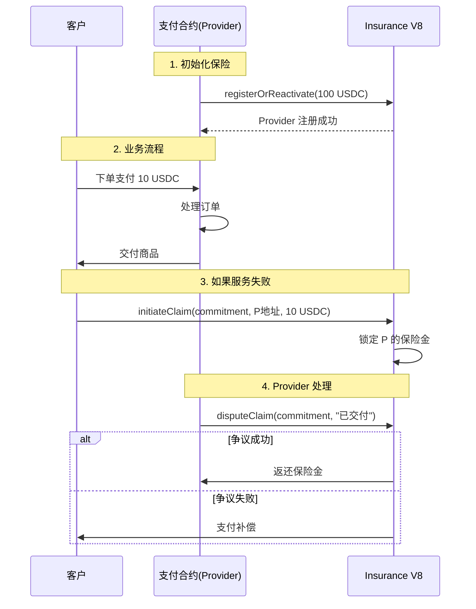

# 业务合约集成保险功能指南

## 问题场景

你有一个已经在运行的业务合约（比如 DEX、支付服务、跨链桥等），现在想为用户提供保险功能。

**核心问题：业务合约怎么操作保险功能？**

---

## 🎯 解决方案总览

### 关键发现

**业务合约可以直接调用 Insurance V8 的函数！**

只要业务合约内部调用 `insuranceV8.registerOrReactivate()`，那么：
- `msg.sender` = 你的业务合约地址
- 你的业务合约地址就成为了 Provider
- 客户向你的合约地址发起索赔
- 你的合约可以自动处理或手动争议

---

## 📦 方案选择

| 场景 | 推荐方案 | 复杂度 |
|------|----------|--------|
| **新合约，可以自由设计** | 方案 A：内置保险 | ⭐⭐ |
| **已部署，可以升级** | 方案 A：添加保险功能 | ⭐⭐⭐ |
| **已部署，不能修改** | 方案 B：适配器模式 | ⭐⭐⭐⭐ |

---

## 方案 A：业务合约内置保险（推荐）

### 完整示例

我已经创建了一个完整的示例合约：
**`/contracts/src/examples/PaymentContractWithInsurance.sol`**

### 核心代码

```solidity
contract YourBusinessContract {
    address constant INSURANCE_V8 = 0x72486eF40BB3729298369d608de85c612adb223e;
    address constant USDC = 0x036CbD53842c5426634e7929541eC2318f3dCF7e;

    // ==================== 你的业务逻辑 ====================

    function yourBusinessLogic() external {
        // ... 你的代码
    }

    // ==================== 保险功能 ====================

    /**
     * 步骤 1：激活保险
     * 部署后调用一次
     */
    function enableInsurance(uint256 amount) external onlyOwner {
        // 授权 USDC
        IERC20(USDC).approve(INSURANCE_V8, amount);

        // 注册为 Provider
        // 重要：msg.sender 此时是本合约地址！
        IInsurance(INSURANCE_V8).registerOrReactivate(amount);
    }

    /**
     * 步骤 2：处理索赔
     */
    function handleClaim(bytes32 claimId, bytes32 orderId) external onlyOwner {
        // 检查订单是否已交付
        if (orders[orderId].delivered) {
            // 已交付，争议索赔
            IInsurance(INSURANCE_V8).disputeClaim(
                claimId,
                "Order was delivered"
            );
        }
        // 未交付，什么都不做，接受索赔
    }
}
```

### 使用流程

```javascript
// 1. 部署你的业务合约
const contract = await YourBusinessContract.deploy();

// 2. 向合约转入 USDC
await usdc.transfer(contract.address, ethers.parseUnits('100', 6));

// 3. 激活保险
await contract.enableInsurance(ethers.parseUnits('100', 6));

// 完成！你的业务合约现在就是 Provider

// 4. 业务流程
// 客户下单
await contract.createOrder(orderId, client, amount);

// 你交付服务
await contract.deliverOrder(orderId);

// 如果客户索赔，你处理
await contract.handleClaim(claimCommitment, orderId);
// 合约会自动检查订单状态，决定接受或争议
```

---

## 方案 B：适配器模式（已部署合约）

如果你的业务合约已经部署，不能修改，使用适配器：

### 适配器合约

```solidity
contract InsuranceAdapter {
    address public immutable businessContract;  // 你的业务合约
    address public immutable insuranceV8;
    address public manager;

    // 记录服务交付状态
    mapping(bytes32 => bool) public serviceDelivered;

    constructor(address _businessContract, address _insuranceV8) {
        businessContract = _businessContract;
        insuranceV8 = _insuranceV8;
        manager = msg.sender;
    }

    // 注册为 Provider
    function registerAsProvider(uint256 amount) external {
        require(msg.sender == manager);

        IERC20(USDC).approve(insuranceV8, amount);
        IInsurance(insuranceV8).registerOrReactivate(amount);
    }

    // 标记服务已交付
    function markDelivered(bytes32 serviceId) external {
        require(
            msg.sender == businessContract || msg.sender == manager
        );
        serviceDelivered[serviceId] = true;
    }

    // 处理索赔
    function handleClaim(bytes32 claimId, bytes32 serviceId) external {
        if (serviceDelivered[serviceId]) {
            IInsurance(insuranceV8).disputeClaim(claimId, "Delivered");
        }
    }
}
```

### 使用流程

```javascript
// 1. 部署适配器
const adapter = await InsuranceAdapter.deploy(
    yourBusinessContractAddress,
    INSURANCE_V8_ADDRESS
);

// 2. 向适配器转入 USDC
await usdc.transfer(adapter.address, ethers.parseUnits('100', 6));

// 3. 注册
await adapter.registerAsProvider(ethers.parseUnits('100', 6));

// 4. 业务流程
// 当服务交付后，标记
await adapter.markDelivered(serviceId);

// 处理索赔
await adapter.handleClaim(claimCommitment, serviceId);
```

---

## 🔄 完整工作流程

### 示例：支付服务集成保险



---

## 💡 实战技巧

### 技巧 1：自动化索赔处理

```solidity
function handleClaim(bytes32 claimId, bytes32 orderId) external {
    Order memory order = orders[orderId];

    if (order.delivered) {
        // 自动争议
        IInsurance(INSURANCE_V8).disputeClaim(
            claimId,
            string(abi.encodePacked(
                "Delivered at ",
                uint2str(order.deliveredAt)
            ))
        );
    }
    // 未交付自动接受，无需代码
}
```

### 技巧 2：批量处理

```solidity
function batchHandleClaims(ClaimData[] calldata claims) external {
    for (uint i = 0; i < claims.length; i++) {
        if (orders[claims[i].orderId].delivered) {
            IInsurance(INSURANCE_V8).disputeClaim(
                claims[i].claimId,
                "Delivered"
            );
        }
    }
}
```

### 技巧 3：链上验证

```solidity
function handleClaim(bytes32 claimId, bytes32 txHash) external {
    // 查询链上数据验证交易
    if (isTransactionSuccessful(txHash)) {
        IInsurance(INSURANCE_V8).disputeClaim(
            claimId,
            string(abi.encodePacked("TX: ", txHash))
        );
    }
}
```

---

## 📊 Gas 成本估算

| 操作 | Gas 成本 | 备注 |
|------|----------|------|
| enableInsurance() | ~50,000 | 只需调用一次 |
| handleClaim() | ~30,000 | 每次索赔 |
| batchHandleClaims(10) | ~200,000 | 批量处理更省 gas |

---

## 🚨 常见错误

### 错误 1：忘记授权 USDC

```solidity
// ❌ 错误
IInsurance(INSURANCE_V8).registerOrReactivate(amount);

// ✅ 正确
IERC20(USDC).approve(INSURANCE_V8, amount);
IInsurance(INSURANCE_V8).registerOrReactivate(amount);
```

### 错误 2：合约没有 USDC

```javascript
// ❌ 错误
await contract.enableInsurance(ethers.parseUnits('100', 6));

// ✅ 正确
await usdc.transfer(contract.address, ethers.parseUnits('100', 6));
await contract.enableInsurance(ethers.parseUnits('100', 6));
```

### 错误 3：混淆 msg.sender

```solidity
// 当用户调用你的合约时：
// msg.sender = 用户地址

// 当你的合约调用 Insurance V8 时：
// msg.sender = 你的合约地址 ✅
```

---

## 🎯 最佳实践

### 1. 初始化检查

```solidity
bool public insuranceEnabled;

function enableInsurance(uint256 amount) external {
    require(!insuranceEnabled, "Already enabled");
    // ... 注册逻辑
    insuranceEnabled = true;
}
```

### 2. 余额检查

```solidity
function enableInsurance(uint256 amount) external {
    uint256 balance = IERC20(USDC).balanceOf(address(this));
    require(balance >= amount, "Insufficient USDC");
    // ... 注册逻辑
}
```

### 3. 事件记录

```solidity
event InsuranceEnabled(uint256 amount);
event ClaimHandled(bytes32 claimId, bool disputed);

function handleClaim(...) external {
    bool disputed = orders[orderId].delivered;
    if (disputed) {
        IInsurance(INSURANCE_V8).disputeClaim(...);
    }
    emit ClaimHandled(claimId, disputed);
}
```

---

## 📝 完整测试示例

```javascript
describe('Business Contract with Insurance', () => {
    let businessContract;
    let usdc;
    let insurance;

    before(async () => {
        // 部署业务合约
        businessContract = await PaymentContract.deploy();

        usdc = await ethers.getContractAt('IERC20', USDC_ADDRESS);
        insurance = await ethers.getContractAt('IInsurance', INSURANCE_V8);
    });

    it('should enable insurance', async () => {
        // 转入 USDC
        await usdc.transfer(
            businessContract.address,
            ethers.parseUnits('100', 6)
        );

        // 激活保险
        await businessContract.enableInsurance(
            ethers.parseUnits('100', 6)
        );

        // 验证
        const info = await insurance.getProviderInfo(businessContract.address);
        expect(info.isActive).to.be.true;
        expect(info.poolBalance).to.equal(ethers.parseUnits('100', 6));
    });

    it('should handle claim correctly', async () => {
        const orderId = ethers.id('order-1');

        // 创建订单
        await businessContract.createOrder(orderId, client.address, ethers.parseUnits('10', 6));

        // 交付订单
        await businessContract.deliverOrder(orderId);

        // 处理索赔（应该自动争议）
        const claimId = ethers.id('claim-1');
        await businessContract.handleClaim(claimId, orderId);

        // 验证争议已提交
        const claimInfo = await insurance.getClaimInfo(claimId);
        expect(claimInfo.status).to.equal(1); // DISPUTED
    });
});
```

---

## 🔗 相关资源

- [完整示例合约](/contracts/src/examples/PaymentContractWithInsurance.sol)
- [Insurance V8 文档](/docs/FRONTEND_INTEGRATION_GUIDE.md)
- [简化接入指南](/docs/SIMPLE_PROVIDER_ONBOARDING.md)

---

## 💬 FAQ

### Q: 我的合约已经部署了，还能集成保险吗？
**A:** 可以！使用方案 B 的适配器模式，无需修改原合约。

### Q: 保险金会占用我的业务资金吗？
**A:** 是的，保险金需要单独准备。建议使用独立账户管理保险资金。

### Q: 可以随时关闭保险吗？
**A:** 可以，调用 `withdrawInsurance()` 提取资金，或 `withdrawAllAndDeactivate()` 完全退出。

### Q: Gas 费用高吗？
**A:** 在 Base Sepolia（L2）上，Gas 费非常低，几乎可以忽略。

### Q: 如何测试？
**A:** 参考 `/contracts/src/examples/PaymentContractWithInsurance.sol`，在测试网部署测试。

---

**现在你的业务合约可以轻松提供保险功能了！** 🎉
